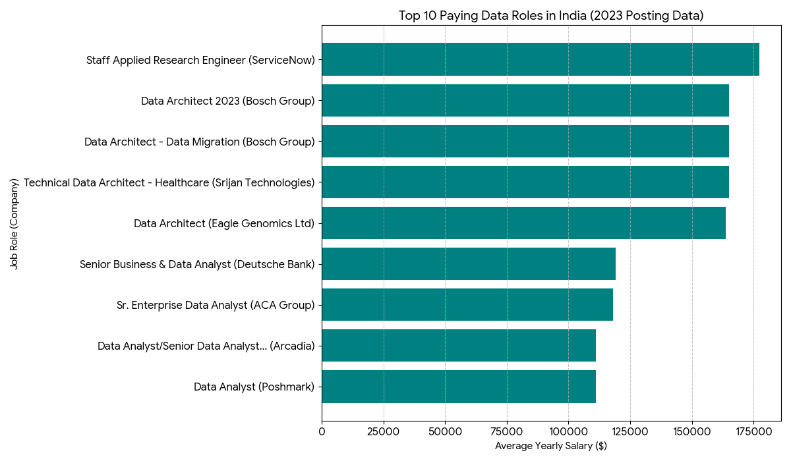
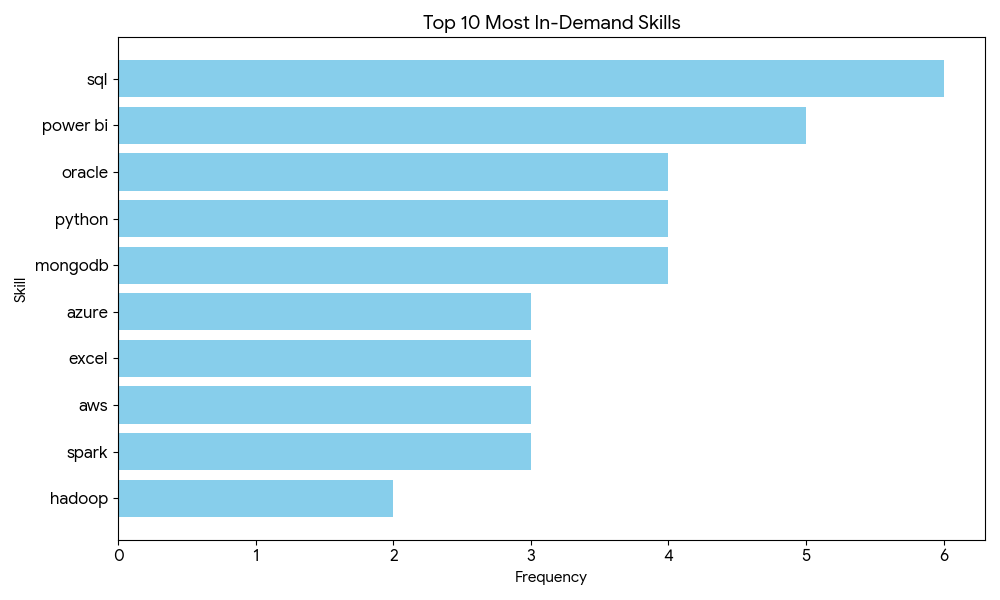

# 📊 Data Analyst Job Market Analysis — India (2023)

## 📌 Overview

This project analyzes the **Data Analyst job market in India (non-remote roles)** using SQL. It focuses on identifying:

* 💰 Top-paying jobs
* 🔥 Most in-demand skills
* ⚖️ Skills that balance demand and salary

The goal is to provide **practical insights for aspiring data analysts in India** on what skills to learn and where the market is heading.

---

## ⚡ 1-Minute Recruiter Summary

- **What I did:**  
  Analyzed 2023 job postings to evaluate the **Data Analyst job market in India (non-remote roles)** using SQL, focusing on salary trends and skill demand  

- **What I found:**  
  - High-paying roles favor **data engineering + database skills** (Spark, Kafka, PostgreSQL)  
  - Core tools like **SQL, Excel, and Power BI** dominate demand  
  - **Cloud and modern data platforms** significantly increase salary potential  

- **Key takeaway:**  
  The Indian market rewards **hybrid analysts** — professionals who can **query, analyze, and build data systems**, not just create reports  

- **Skills demonstrated:**  
  SQL (joins, CTEs, aggregations), data analysis, market insight extraction, real-world dataset handling  

- **Business impact mindset:**  
  This project translates raw job data into **actionable career insights**, helping identify which skills maximize employability and salary in India  

---

## 🎯 Key Highlights

* Data engineering skills (Spark, Kafka, Airflow) dominate **top-paying roles**
* SQL and visualization tools remain **core requirements**
* Cloud and modern data platforms significantly **increase earning potential**
* Pure analysis roles are less lucrative than **hybrid analyst + engineer roles**

---

## 📂 Project Structure

```
📁 project_sql/
 ├── 1_top_paying_jobs.sql
 ├── 2_top_paying_skills.sql
 ├── 3_in_demand_skills.sql
 ├── 4_highest_paying_skills.sql
 └── 5_optimal_skills.sql

📁 assets/
 ├── top_paying_jobs.png
 └── top_paying_skills.png

README.md
```

---

## 🧠 Problem Statement

This project answers key questions about the **Indian data analyst job market**:

1. What are the highest-paying data analyst jobs in India?
2. What skills are required for these roles?
3. What skills are most in demand?
4. Which skills offer the highest salaries?
5. What are the most optimal skills to learn?

---

## 🛠️ Tools & Technologies

* **SQL (PostgreSQL)** — Data querying & analysis
* **VS Code** — Query development
* **Git & GitHub** — Version control & portfolio
* **Dataset** — Adapted from Luke Barousse’s SQL course

---

## 📊 Analysis Breakdown

---

### 1️⃣ Top Paying Data Analyst Jobs (India)

```sql
SELECT
    job_id,
    job_title,
    company_dim.name AS company_name,
    job_location,
    job_schedule_type,
    salary_year_avg,
    job_posted_date::DATE
FROM job_postings_fact
LEFT JOIN company_dim ON job_postings_fact.company_id = company_dim.company_id
WHERE 
    job_title_short = 'Data Analyst' AND
    salary_year_avg IS NOT NULL AND
    job_country = 'India' AND job_location <> 'Anywhere'
ORDER BY salary_year_avg DESC
LIMIT 10;
```

📌 Focus:

* Highest salaries in India (non-remote)
* Role types and company patterns

📷 
*Bar graph visualizing the salary for the top 10 salaries for data analysts; ChatGPT generated this graph from my SQL query results*

---

### 2️⃣ Skills for Top Paying Jobs

```sql
WITH analysts_job AS
(
    SELECT
        job_id,
        job_title,
        company_dim.name AS company_name,
        salary_year_avg
    FROM job_postings_fact
    LEFT JOIN company_dim ON job_postings_fact.company_id = company_dim.company_id
    WHERE 
        job_title_short = 'Data Analyst' AND
        salary_year_avg IS NOT NULL AND
        job_country = 'India' AND job_location <> 'Anywhere'
    ORDER BY salary_year_avg DESC
    LIMIT 10
)

SELECT 
    analysts_job.*,
    skills_dim.skills
FROM analysts_job
INNER JOIN skills_job_dim ON analysts_job.job_id = skills_job_dim.job_id
INNER JOIN skills_dim ON skills_job_dim.skill_id = skills_dim.skill_id
ORDER BY salary_year_avg DESC;
```

📌 Focus:

* Skills linked to top salaries
* Technical vs analytical balance

Here's the breakdown of the most demanded skills for the top 10 highest paying data analyst jobs in 2023 in India:

* **SQL** is the most demanded skill (6 mentions), confirming it as the core requirement for data roles.
* **Power BI (5)** stands out as the leading visualization tool, ahead of Tableau.
* **Python (4)** is the dominant programming language, but appears less frequently than database skills.
* **Oracle and MongoDB (4 each)** indicate strong demand for both relational and NoSQL databases.
* **Cloud platforms (AWS, Azure – 3 each)** are consistently required but not dominant.
* **Big Data tools (Spark, Hadoop, Databricks)** appear moderately, showing importance in higher-level roles.


📷 
*Bar graph visualizing the count of skills for the top 10 paying jobs in India for data analysts; ChatGPT generated this graph from my SQL query results*

---

### 3️⃣ Most In-Demand Skills

```sql
SELECT 
    skills,
    COUNT(skills_job_dim.job_id) AS demand_count 
FROM job_postings_fact
INNER JOIN skills_job_dim ON job_postings_fact.job_id = skills_job_dim.job_id
INNER JOIN skills_dim ON skills_job_dim.skill_id = skills_dim.skill_id
WHERE 
    job_title_short = 'Data Analyst' AND
    job_country = 'India' AND job_location <> 'Anywhere'
GROUP BY skills
ORDER BY demand_count DESC
LIMIT 5;
```

📌 Focus:

* Skills appearing most frequently in job postings

| Skills   | Demand Count |
| -------- | -----------: |
| sql      |         2584 |
| python   |         1819 |
| excel    |         1733 |
| tableau  |         1356 |
| power bi |         1049 |

*Table of the demand for the top 5 skills in data analyst job postings*

Here's the breakdown of the most demanded skills for data analysts in 2023
- **SQL** and **Excel** remain fundamental, emphasizing the need for strong foundational skills in data processing and spreadsheet manipulation.
- **Programming** and **Visualization Tools** like **Python**, **Tableau**, and **Power BI** are essential, pointing towards the increasing importance of technical skills in data storytelling and decision support.

---

### 4️⃣ Highest Paying Skills

```sql
SELECT 
    skills,
    ROUND(AVG(salary_year_avg), 2) AS average_salary
FROM job_postings_fact
INNER JOIN skills_job_dim ON job_postings_fact.job_id = skills_job_dim.job_id
INNER JOIN skills_dim ON skills_job_dim.skill_id = skills_dim.skill_id
WHERE 
    job_title_short = 'Data Analyst' AND
    salary_year_avg IS NOT NULL AND
    job_country = 'India' AND job_location <> 'Anywhere'
GROUP BY skills
ORDER BY average_salary DESC
LIMIT 25;
```

📌 Focus:

* Skills with the highest average salaries

| Skills     | Average Salary |
| ---------- | -------------: |
| pyspark    |      165000.00 |
| gitlab     |      165000.00 |
| postgresql |      165000.00 |
| linux      |      165000.00 |
| mysql      |      165000.00 |
| neo4j      |      163782.00 |
| gdpr       |      163782.00 |
| airflow    |      138087.50 |
| mongodb    |      135994.00 |
| scala      |      135994.00 |
| databricks |      135994.00 |
| pandas     |      122462.50 |
| kafka      |      122100.00 |
| confluence |      119250.00 |
| visio      |      119250.00 |
| shell      |      118500.00 |
| spark      |      118332.45 |

*Table of the average salary for the top 10 paying skills for data analysts*

Here's a breakdown of the results for top paying skills for Data Analysts:
* **Top salaries are driven by data engineering skills, not pure analysis**
  Tools like PySpark, Spark, Kafka, Airflow, and Databricks dominate, showing that building and managing data pipelines is more valuable than just analyzing data.

* **Strong database + big data expertise is a major differentiator**
  High-paying roles require depth across PostgreSQL, MySQL, MongoDB, Neo4j, and NoSQL systems, along with the ability to handle large-scale distributed data.

* **Modern data stack + niche skills significantly boost pay**
  Cloud/data platforms (Snowflake, Databricks), DevOps tools (GitLab, Jira), and specialized areas (GDPR, graph databases) increase salaries, while visualization tools play a smaller role in top-paying jobs.


---

### 5️⃣ Optimal Skills (High Demand + High Pay)

```sql
SELECT 
    skills_dim.skill_id,
    skills_dim.skills,
    COUNT(skills_job_dim.job_id) AS demand_count,
    ROUND(AVG(salary_year_avg), 2) AS average_salary
FROM job_postings_fact
INNER JOIN skills_job_dim ON job_postings_fact.job_id = skills_job_dim.job_id
INNER JOIN skills_dim ON skills_job_dim.skill_id = skills_dim.skill_id
WHERE
    job_title_short = 'Data Analyst' AND
    salary_year_avg IS NOT NULL AND
    job_country = 'India' AND job_location <> 'Anywhere'
GROUP BY skills_dim.skill_id
HAVING COUNT(skills_job_dim.job_id) > 5
ORDER BY 
    average_salary DESC,
    demand_count DESC
```

📌 Focus:

* Best skills to learn based on market value

| Skill ID | Skills     | Demand Count | Average Salary |
| -------- | ---------- | ------------ | -------------: |
| 92       | spark      | 11           |      118332.45 |
| 183      | power bi   | 17           |      109832.18 |
| 215      | flow       | 6            |      104751.25 |
| 79       | oracle     | 11           |      104260.32 |
| 196      | powerpoint | 10           |      102677.50 |
| 185      | looker     | 10           |       98815.00 |
| 74       | azure      | 15           |       98569.80 |
| 1        | python     | 36           |       95933.33 |
| 76       | aws        | 12           |       95333.00 |
| 182      | tableau    | 20           |       95102.80 |
| 0        | sql        | 46           |       92983.62 |
| 181      | excel      | 39           |       88518.96 |
| 5        | r          | 18           |       86609.11 |
| 188      | word       | 10           |       83266.05 |

*Table of the most optimal skills for data analyst sorted by salary*

Here's a breakdown of the most optimal skills for Data Analysts in India in 2023:
* **Core skills (SQL, Python, Excel, Tableau) provide the best balance of demand and salary**
  These are essential for employability and form the foundation of most data analyst roles in India.

* **Cloud and big data tools (Spark, Azure, AWS, Oracle) drive higher salaries**
  These skills act as differentiators and can significantly boost earning potential when combined with core skills.

* **Visualization and business tools (Power BI, Looker, Excel, PowerPoint) offer strong ROI**
  They sit in the sweet spot of good demand and solid pay, highlighting the importance of data storytelling and business communication.

---

## 📈 Key Insights

* **Engineering > Analysis:**
  Highest salaries are tied to data engineering and backend skills rather than pure analytics

* **Databases + Big Data are Critical:**
  PostgreSQL, MongoDB, Spark, and Kafka are strong salary drivers

* **Modern Data Stack Matters:**
  Tools like Snowflake, Databricks, and Airflow increase market value

* **Visualization ≠ High Pay:**
  Tools like Power BI/Tableau are essential but not top-paying

* **Hybrid Skillset Wins:**
  The most valuable profiles combine:

  * SQL + Data Handling
  * Programming
  * Data Engineering Concepts

---

## 🎓 What I Learned

* Writing advanced SQL queries using joins, CTEs, and aggregations
* Analyzing real-world datasets to extract meaningful insights
* Understanding how the Indian job market values different skills

---

## 🚀 Conclusion

The Indian data analyst market is evolving toward **hybrid roles**:


From the analysis, several general insights emerged:

1. **Top-Paying Data Analyst Jobs**: The highest-paying jobs for data analysts those are available in India offer a wide range of salaries, the highest at $177,283!
2. **Skills for Top-Paying Jobs**: High-paying data analyst jobs require advanced proficiency in SQL, suggesting it’s a critical skill for earning a top salary.
3. **Most In-Demand Skills**: SQL is also the most demanded skill in the data analyst job market, thus making it essential for job seekers.
4. **Skills with Higher Salaries**: Specialized skills, such as SVN and Solidity, are associated with the highest average salaries, indicating a premium on niche expertise.
5. **Optimal Skills for Job Market Value**: SQL leads in demand and offers for a high average salary, positioning it as one of the most optimal skills for data analysts to learn to maximize their market value.


### Final Summary
> Analysts who can **build, process, and analyze data** earn significantly more than those who only analyze.

### Closing Thoughts

This project enhanced my SQL skills and provided valuable insights into the data analyst job market. The findings from the analysis serve as a guide to prioritizing skill development and job search efforts. Aspiring data analysts can better position themselves in a competitive job market by focusing on high-demand, high-salary skills. This exploration highlights the importance of continuous learning and adaptation to emerging trends in the field of data analytics.


---

## 📎 Dataset Credit

This project uses data from [**Luke Barousse’s SQL course**](https://www.lukebarousse.com/sql).

---
## ⭐ If You Found This Useful

Consider starring ⭐ the repository or using it as a reference for your own projects.